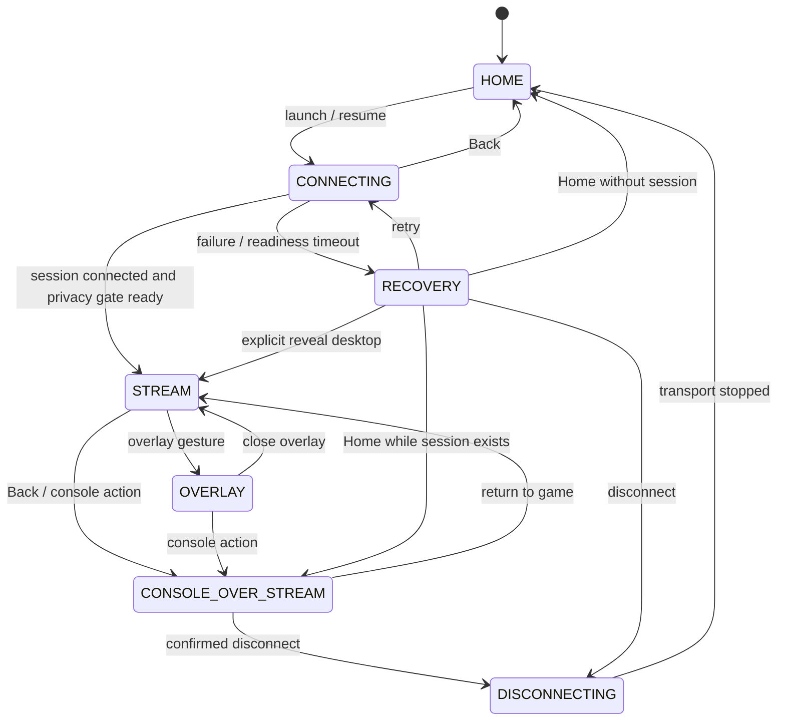

# MoonWaker Game App architecture

Status: milestone 1, 2026-07-15

MoonWaker is migrated inside the Moonlight Android repository. The production
application ID remains `com.limelight.unofficial`; existing Moonlight host data,
native transport, decoder, and public compatibility contracts remain in place.
New console code lives under `com.limelight.console.*`.

## State model

Back is an input event handled by the state machine. It does not implicitly
finish the Activity. On `HOME` it requests an exit-confirmation modal. On
`STREAM` it covers the live surface with console Home and releases gameplay
input capture.

## Layer ownership and lifetime

`ConsoleActivity` owns one persistent root `FrameLayout`, ordered bottom to top:

1. `StreamSurfaceHost` layer. It owns the stable decoder surface. While a
   session is active it remains attached and is never set to `GONE`.
2. `LoadingPrivacyGate`. It is fully opaque while connection/readiness is
   unresolved and during recovery transitions.
3. Console Home. It is opaque in `HOME` and `CONSOLE_OVER_STREAM`.
4. Stream overlay, including the Discord focus region.
5. Modal/recovery layer.

`StreamSessionController` is the sole owner of the session lifetime and the
only boundary allowed to create or stop transport/decoder resources. A single
active session therefore has exactly one `NvConnection` and decoder. The
Activity and visual layers observe it; they do not infer disconnect from view
visibility or surface callbacks.

During milestone 1, `LegacyGameSessionAdapter` characterized the existing
`Game` lifecycle. The next extraction introduced
`MoonlightStreamSessionController` as the real owner of `NvConnection`
construction, start, stop, and transport state. `Game` remains the listener,
decoder view adapter, and temporary input sender; it cannot start a second
connection. The existing background-surface fallback is retained until the
unified path passes the P0 A-F regression suite on TV.

## Input and focus routing

`ConsoleStateMachine` produces an explicit `InputTarget` for each state:

| State | Input target | Gameplay capture |
| --- | --- | --- |
| `HOME`, `CONSOLE_OVER_STREAM` | Home | released |
| `CONNECTING`, `DISCONNECTING` | none/modal | released |
| `STREAM` | game | captured |
| `OVERLAY` | overlay focus region | released |
| `RECOVERY` | recovery modal | released |

Home, overlay, and future Discord panels use explicit focus regions. Passive
provider, status, Gateway, and artwork callbacks update content only: they never
call `requestFocus()`. A user-triggered host-to-app transition may move focus if
the originating host still owns focus. App lists preserve the focused stable ID
and scroll position when refreshed.

Milestone 1 uses the shared `InputRouter` in both `ConsoleActivity` and legacy
`Game`. `Game` still performs the platform capture calls, but the active region
and the capture/no-capture decision no longer live in an unstructured boolean.

## Loading and future launch contract

`LaunchOrchestrator` is neutral with respect to Moonlight, Playnite, or Steam.
It accepts a versioned request scoped by `(hostUuid, integrationProfileId)` and
reports lifecycle/readiness samples. `LoadingPrivacyGate` requires a decoded
frame and, for managed launches, Bridge readiness. Readiness means a visible,
non-cloaked foreground window on the streamed display with final geometry stable
for consecutive samples. A process existing is not readiness.

Timeout recovery is bounded and controller-operable: Retry, Home, explicit
Reveal Desktop, and Disconnect. Returning to Playnite is a future non-destructive
orchestrator action and must never map to `QUIT_STREAM_APP`.

## Storage migration

Moonlight's existing database, preferences, host certificates, and application
cache remain authoritative and are read in place. Console-owned preferences use
new, namespaced keys. Gateway/profile state is keyed by
`(hostUuid, integrationProfileId)`.

Wake import will be additive, versioned, and idempotent:

- write an import-version marker only after a complete successful import;
- merge records without deleting or renaming legacy keys/tables;
- never log tokens, certificate fingerprints, or DPAPI material;
- keep Wake installed and its store untouched through the rollback window;
- prefer a signature-protected migration provider in the final Wake APK.

Downgrade safety is a data requirement: installing an older APK is not treated
as a repair for destructive schema changes.

## Upstream boundary

The official Moonlight Android repository is the `upstream` remote. New product
code belongs under `com.limelight.console.*`; native protocol/JNI code and
`moonlight-common-c` remain upstream based. Hooks in legacy Moonlight code must
be small, separately revertible, documented in `UPSTREAM_PATCHES.md`, and backed
by a characteristic regression test. No repository-wide rename or formatting
is part of migration.

Artemis is a source for narrowly selected patches only. Vibepollo currently uses
the standard protocol and does not justify replacing the official core.

## Legacy removal gates

Legacy `Game`, `PcView`, public providers/intents, external-frontend session
metadata, and background-surface fallback remain until their replacement passes
sections A-F of `UNIFIED_CONSOLE_REGRESSION_BASELINE.md` on the TV. Evidence must
include a signed update preserving stored hosts, a fresh-start screen recording,
two Stream -> Home -> Stream cycles with changing video and real input, and
lifecycle/decoder logs proving no second connection and no surface destruction.

Remove one compatibility path per commit. Each removal must name its rollback
commit and retain separate Disconnect and Quit Host Application actions.
